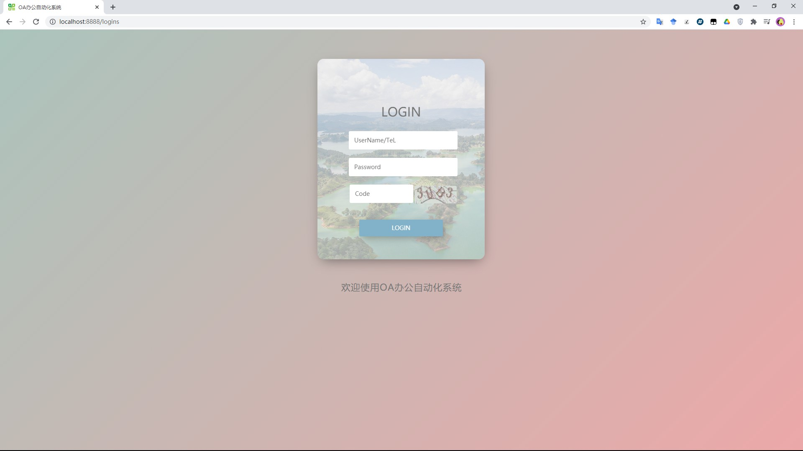
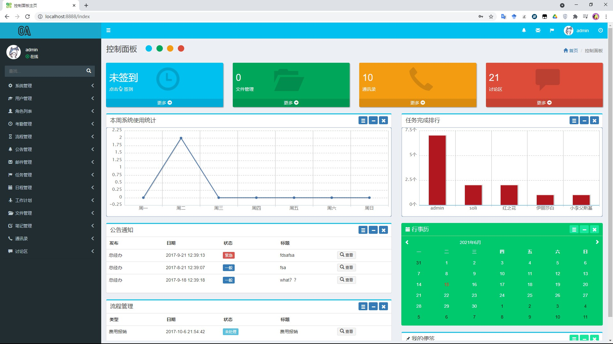
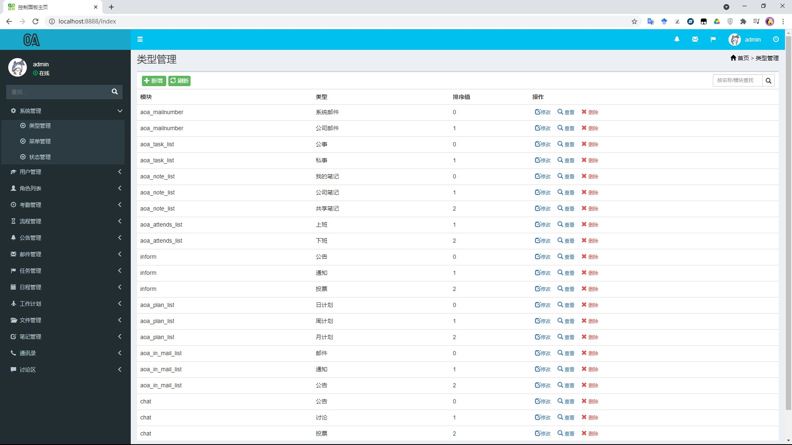
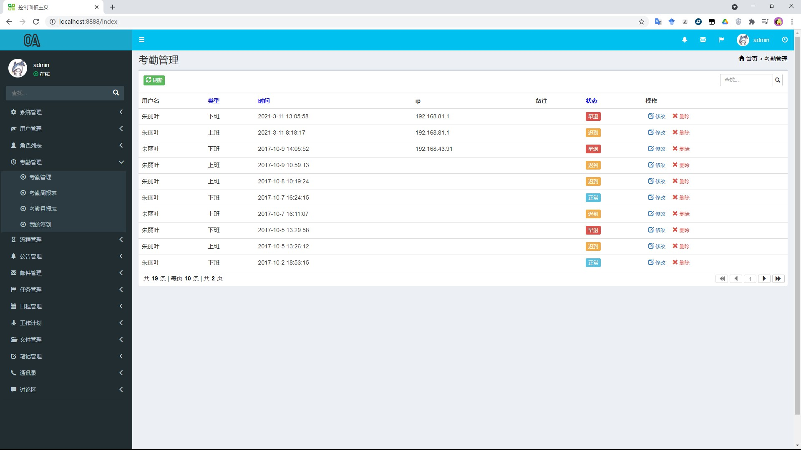
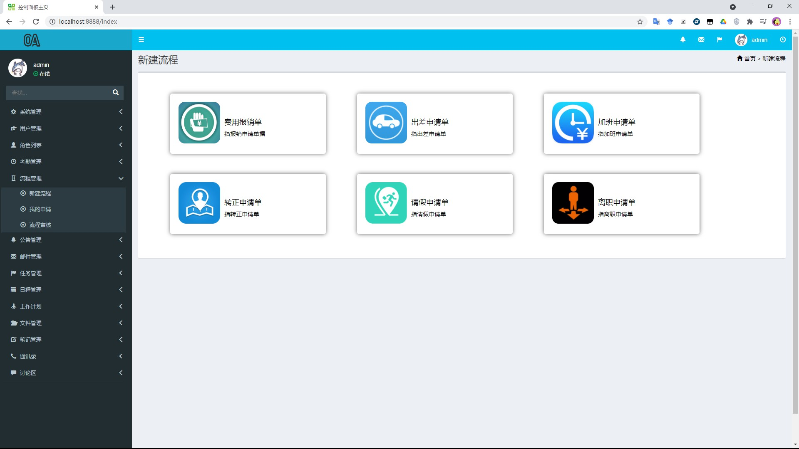
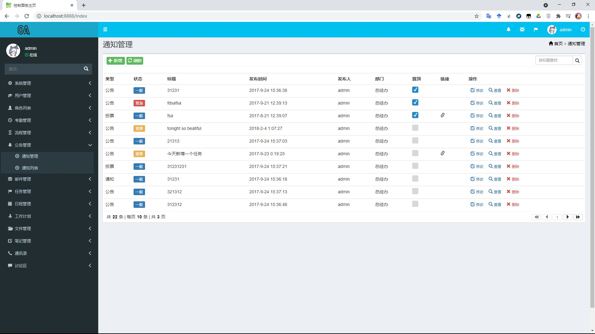
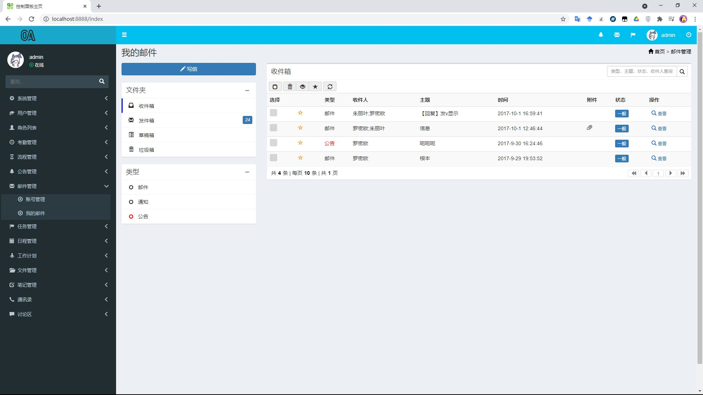
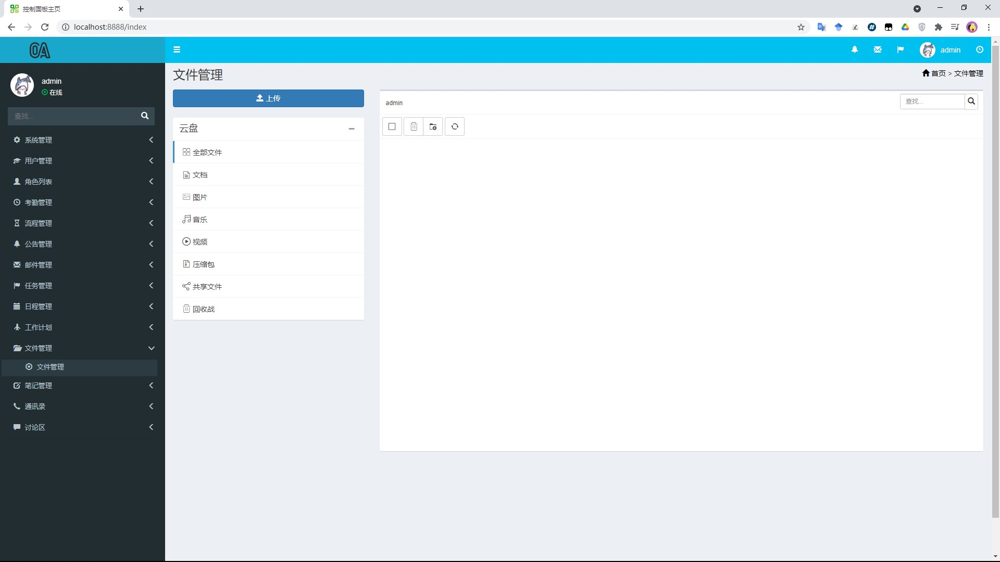
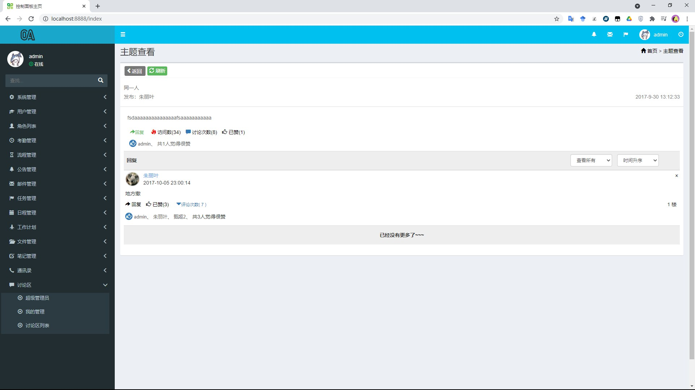
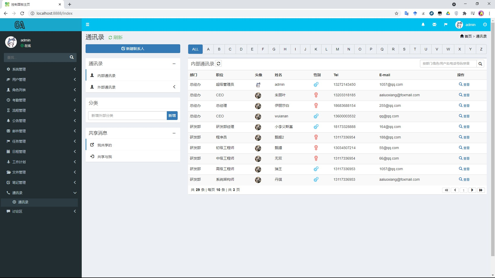

# oasystem

## 平台简介

基于SpringBoot的OA办公自动化系统

使用技术：

后端

- springboot
- mybatis

前端：

- bootstrap
- easyui

## 内置功能

1.  系统管理
2.  用户管理
3.  角色管理
4.  考勤管理
5.  流程管理
6.  公告管理
7.  邮件管理
8.  任务管理
9.  日程管理
10.  工作管理
11.  文件管理
12.  笔记管理
13.  通讯录
14.  讨论区

## 演示图

<table>
    <tr>
        <td></td>
        <td></td>
    </tr>
    <tr>
        <td></td>
        <td></td>
    </tr>
     <tr>
        <td></td>
        <td></td>
    </tr>
      <tr>
        <td></td>
        <td></td>
    </tr>
     <tr>
        <td></td>
        <td></td>
    </tr>

</table>